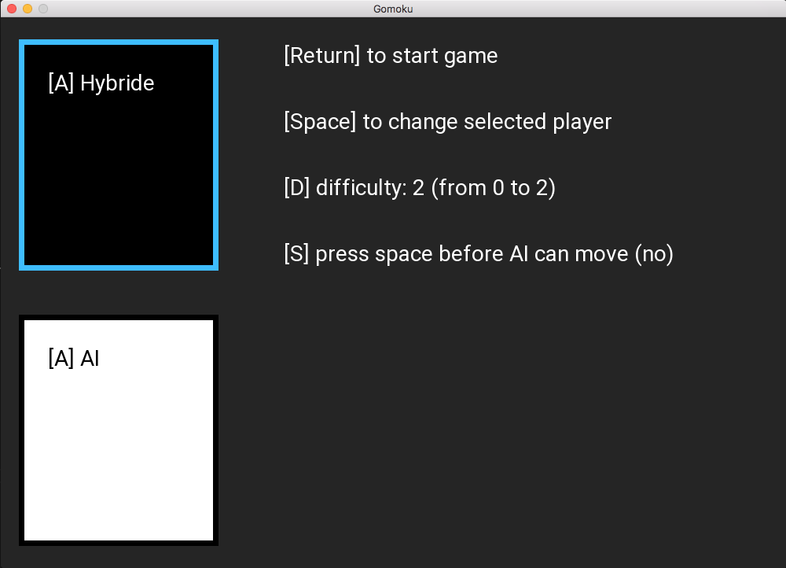
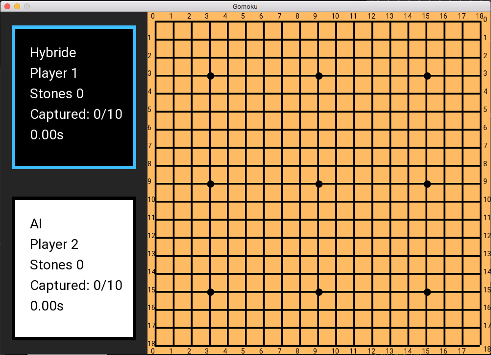
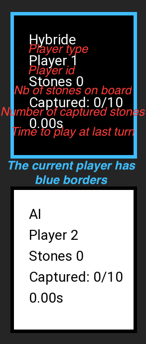
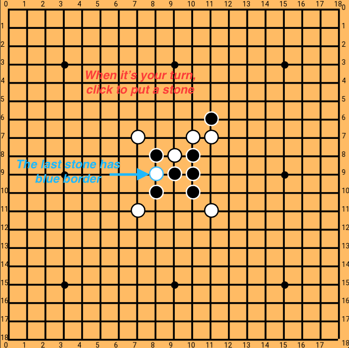

# gomoku_cpp [[42](https://www.42.fr/) project]


The same as [gomoku](https://github.com/tnicolas42/gomoku) but with c++

More informations on the [subject](gomoku.pdf).

Let's try to use c++ instead of python to go faster 🚀

## Make the project

``` bash
make -j10
```

when you make the project, you can change some parameters like the windows size, the board size, ... To know all the parameter:
``` bash
>>> make help
Help:
	To change the size of the win: SIZE (1000)
	To change the size of the board (max 21): BOARD_SZ (19)
	To change the number of stone to align to win: NB_ALIGNED_VICTORY (5)
	To change the number of stone to destroy to win: NB_DESTROYED_VICTORY (10)
/!\ If you change a parameter, remake all the project
```

For example:
``` bash
make re NB_ALIGNED_VICTORY=8  # you need to align 8 stones to win
make re SIZE=1800  # the windows size will be 1800
```
**/!\ To change a parameter, you need to remake all the projet**

**/!\ If you put a wrong value, the program may not compile or crash**

To make and execute the program:
``` bash
make exec -j10
```

## Run the project

``` bash
./gomoku
```
### Menu
This will open the menu:

On the menu, you can changes some parameters:
- press `A` to change the player type (`Hybride | Player | AI`).
- press `space` to select the other player (to change his type).
- press `D` to change difficulty (`0 | 1 | 2`).
- if you press `S`, you need to press space before start the AI turn.
- press `Return` to start the game.

#### Player types
##### RealPlayer
In RealPlayer mode, you play.
##### AI
In AI mode, the AI play. If enabled in parameter, you need to press space before AI turn.
##### Hybride
The Hybride mode is a mix of Real and AI players.
In Hybride mode, you play like with RealPlayer but if you press space once, you have a marker to show you a good place to play. If you re press space, the Hybride player will player instead of you.

### Game
#### Rules
Black plays first, and players alternate in placing a stone of their color on an empty intersection.
- You can remove a pair of your opponent’s stones from the board by flanking them with your own stones.
- No double-threes : It is forbidden to play a move that introduces two free-three
alignments, which would guarantee a win by alignment. (see on the [subject](gomoku.pdf))

Victory:
- Get an unbroken row of five stones horizontally, vertically, or diagonally.
- Remove 10 oponent stones.



The game is divised in 2 part:
Information band

Board



#### Example in hard mode AI vs AI


